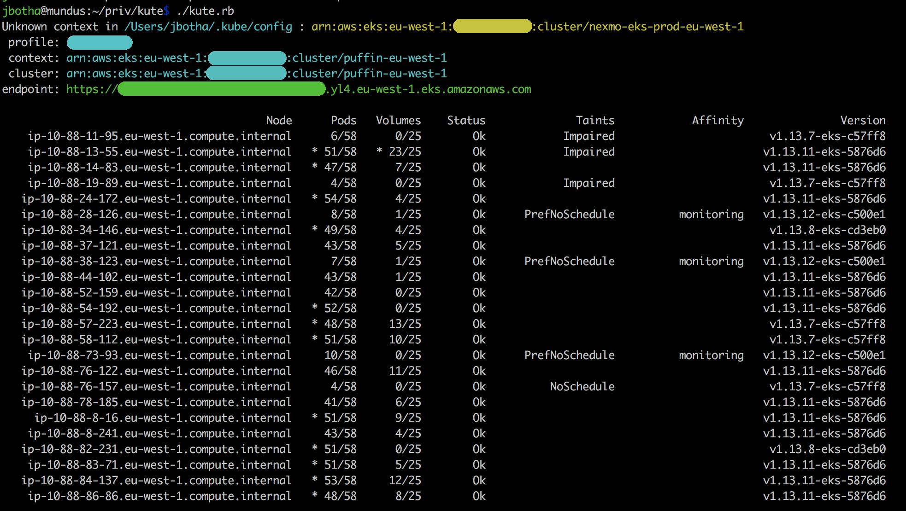

## kute

###### version 0.0.1

#### Overview

Kute is a lightweight EKS cluster viewer that is intended to provide better information density
than kubectl does.  It creates a heads up display of an EKS cluster, displaying nodes along with
their capacities, kubelet version, and pod and volume capacity based on published AWS stats.

`kute` is intended to provide a very quick top-level view of a cluster that will serve as a launch
point for further investigation when there are issues reported with the cluster.

###### Default settings

By default, `kute` displays the following columns of data:

 * Node name
 * Pod count (current / maximum), > 80% occupancy indicated with a `*`
 * Volume count (current / maximum), >80% occupancy indicated with a `*`
 * Status, broken down as 
   * X if kubelet is not posting Ready
   * Mem if the node is under memory pressure
   * Dsk if the node is under disk pressure
   * Pid if the node is under process pressure
   * Ok otherwise
 * Taints, broken down as
   * Impaired if the node has a taint prefixed by `NodeWithImpaired`
   * PrefNoSchedule if the node has been manually tainted with `PreferNoSchedule`
   * NoSchedule if the node has any taint suffixed with `NoSchedule` not caught above
 * Affinity, based on a label `kubernetes.io/affinity` that can be used for pod affinity
 * Version, the kubelet version on the node.    
 
Other options will be added to this list. 

###### Installation

Ruby 2.5.1 is required by default.  If you do not have ruby, or are using a system ruby,
it is suggested that you install RBEnv as detailed here: [https://github.com/rbenv/rbenv](https://github.com/rbenv/rbenv)

Once rbenv is installed, install ruby 2.5.1 by running `rbenv install` from the root folder of `kute`

    jbotha@mundus:~/ruby/kute$ rbenv install
    
Once ruby 2.5.1 is install, test it:

    jbotha@mundus:~/ruby/kute$ ruby --version
    ruby 2.5.1p57 (2018-03-29 revision 63029) [x86_64-darwin17] 
    
Next, install bundler:    
    
    jbotha@mundus:~/ruby/kute$ gem install bundler
    Fetching: bundler-2.1.1.gem (100%)
    Successfully installed bundler-2.1.1
    Parsing documentation for bundler-2.1.1
    Installing ri documentation for bundler-2.1.1
    Done installing documentation for bundler after 5 seconds
    1 gem installed
    
And then install the gems required by kute:

    jbotha@mundus:~/ruby/kute$ bundle install
    Using public_suffix 4.0.1
       ...
    Bundle complete! 4 Gemfile dependencies, 24 gems now installed.
    Use `bundle info [gemname]` to see where a bundled gem is installed.
    
Finally, verify that kute can be run:

    jbotha@mundus:~/ruby/kute$ ./kute.rb -h
    Usage: kute.rb [options]
        -v, --[no-]verbose               Log debug information to stdout
        -p, --profile                    Specify the profile to use for connection
        -n, --cluster-name               Specify the cluster name for the bearer auth token
        -c, --cluster                    Specify the cluster you wish to connect to
    
###### Authentication
      
`kute` searches for `${HOME}/.kube/config` and parses it, looking for information to identify
known EKS clusters.  

It will attempt to locate the `current-context` within this file and use the named cluster
  as its endpoint unless an alternative is provided via `--cluster`.  
  
It looks for the environment variable `AWS_PROFILE` and defaults to the `default`
profile if none is specified via `--profile`.   

You can manually specify the cluster name for authentication via `--cluster-name` in the event you
are experiencing authentication issues.

                  