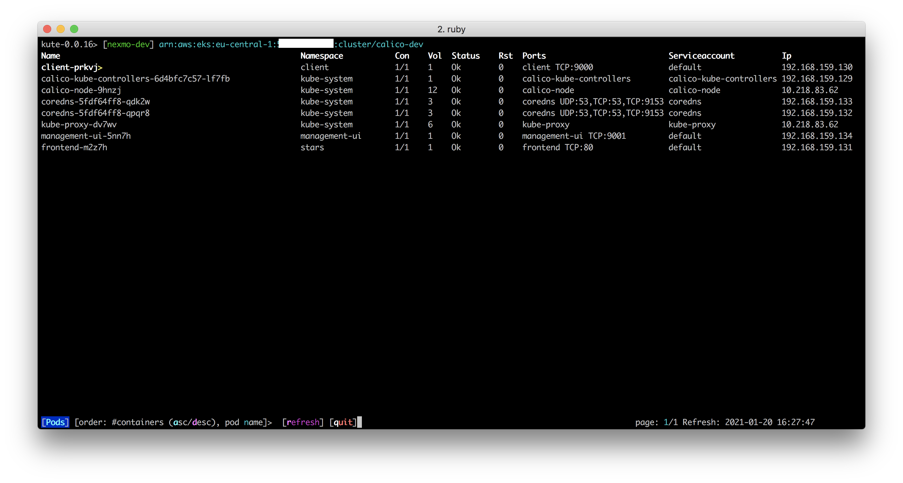
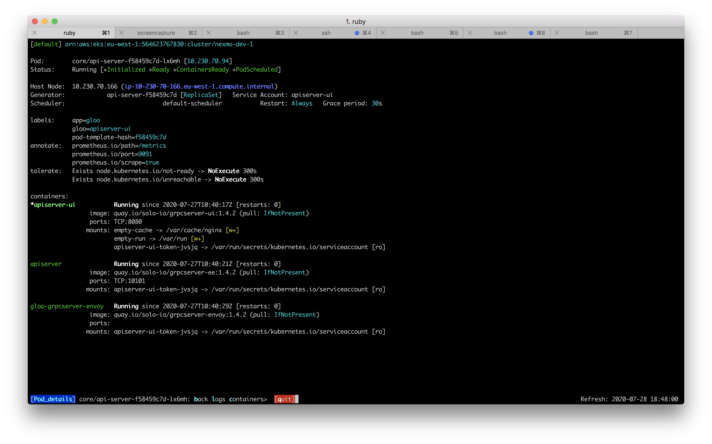

## kute

###### version 0.0.8

###### TODO

1. cw metrics
2. services
3. ingresses
4. config maps etc
6. paging
7. sorting
 

#### Overview

`kute` is a lightweight EKS cluster viewer that is intended to provide better information density
than kubectl does.  It creates a heads up display of an EKS cluster, displaying nodes along with
their capacities, kubelet version, and pod and volume capacity based on published AWS stats.

`kute` is intended to provide a very quick top-level view of a cluster that will serve as a launch
point for further investigation when there are issues reported with the cluster.

#### Node List

The node listing displays:

* Node name
* Node age in human readable format
* Node region and AZ
* Pods ( running / max possible on this node )
* Volumes ( mounted / max possible on this node )
* Node status
* Taints present on the Node
* Tolerations present on the Node
* EKS version of the node

The currently selected node is highlighted, and if you wish you can drill down into this node to see details
on the pods and their health.  Nodes with some sort of pod or container related issue are coloured yellow,
healthy nodes are terminal grey.  Select the node of interest and hit `enter` or `right` to drill down into it.

###### Nodes pane navigation:

* `^` : Go to the first page of nodes
* `space` : Go to the next page of nodes
* `b` : Go to the previous page of nodes
* `$` : Go to the last page of nodes 

###### Nodes pane sorting:
* `a` will sort by pod occupancy in ascending value
* `d` will sort by pod occupancy in descending value
* `@` will sort by node name

###### Node pane searching
* `/` and a regex pattern will try to find nodes running pods with names that match that pattern
* `*` will remove any search pattern entered with `/`

In the node details screen, you are presented with a list of pods running on the selected node.  
The pod listing displays:

* Pod Name
* Pod Namespace
* Containers (running / total defined for the pod)
* Volumes
* Pod Status
* Restart count
* An abridged port listing
* The service account
* The IP address of the pod

If there is an issue with any of the containers (i.e. none are state running or state terminated with exit code 0) then
that pod is highlighted in yellow, and the status is set to '*'
 
 
###### POds pane navigation:

* `^` : Go to the first page of pods
* `space` : Go to the next page of pods
* `b` : Go to the previous page of pods
* `$` : Go to the last page of pods 
 
You can scroll down to select a pod, then hit  `enter` or `right` to drill down into it.  Hitting `left` will return 
you to the node listing.

This gives an overview of a particular pod, showing information such as how it was generated (e.g StatefulSet, ReplicaSet), 
the state of its various containers (`:waiting`, `:running` or `:terminated`) and varied detailed information on all of them
such as image, image pull policy, ports, mounts etc.

You can return to the pod listing by hitting `:left`

###### Default settings

By default, `kute` displays the following columns of data:

 * Node name
 * Pod count (current / maximum), > 80% occupancy indicated with a `*`
 * Volume count (current / maximum), >80% occupancy indicated with a `*`
 * Status, broken down as 
   * X if kubelet is not posting Ready
   * Mem if the node is under memory pressure
   * Dsk if the node is under disk pressure
   * Pid if the node is under process pressure
   * Ok otherwise
 * Taints, broken down as
   * Impaired if the node has a taint prefixed by `NodeWithImpaired`
   * PrefNoSchedule if the node has been manually tainted with `PreferNoSchedule`
   * NoSchedule if the node has any taint suffixed with `NoSchedule` not caught above
 * Affinity, based on a label `kubernetes.io/affinity` that can be used for pod affinity
 * Version, the kubelet version on the node.    
 
Other options will be added to this list. 

###### Installation

Ruby 2.5.1 is required by default.  If you do not have ruby, or are using a system ruby,
it is suggested that you install RBEnv as detailed here: [https://github.com/rbenv/rbenv](https://github.com/rbenv/rbenv)

Once rbenv is installed, install ruby 2.5.1 by running `rbenv install` from the root folder of `kute`

    jbotha@mundus:~/ruby/kute$ rbenv install
    
Once ruby 2.5.1 is installed, test it:

    jbotha@mundus:~/ruby/kute$ ruby --version
    ruby 2.5.1p57 (2018-03-29 revision 63029) [x86_64-darwin17] 
    
Next, install bundler:    
    
    jbotha@mundus:~/ruby/kute$ gem install bundler
    Fetching: bundler-2.1.1.gem (100%)
    Successfully installed bundler-2.1.1
    Parsing documentation for bundler-2.1.1
    Installing ri documentation for bundler-2.1.1
    Done installing documentation for bundler after 5 seconds
    1 gem installed
    
And then install the gems required by kute:

    jbotha@mundus:~/ruby/kute$ bundle install
    Using public_suffix 4.0.1
       ...
    Bundle complete! 4 Gemfile dependencies, 24 gems now installed.
    Use `bundle info [gemname]` to see where a bundled gem is installed.
    
Finally, verify that kute can be run:

    jbotha@mundus:~/ruby/kute$ ./kute.rb -h
    Usage: kute.rb [options]
        -v, --[no-]verbose               Log debug information to stdout
        -p, --profile                    Specify the profile to use for connection
        -n, --cluster-name               Specify the cluster name for the bearer auth token
        -c, --cluster                    Specify the cluster you wish to connect to
    
###### Authentication
      
`kute` searches for `${HOME}/.kube/config` and parses it, looking for information to identify
known EKS clusters.  

It will attempt to locate the `current-context` within this file and use the named cluster
  as its endpoint unless an alternative is provided via `--cluster`.  
  
It looks for the environment variable `AWS_PROFILE` and defaults to the `default`
profile if none is specified via `--profile`.   

You can manually specify the cluster name for authentication via `--cluster-name` in the event you
are experiencing authentication issues.

                  