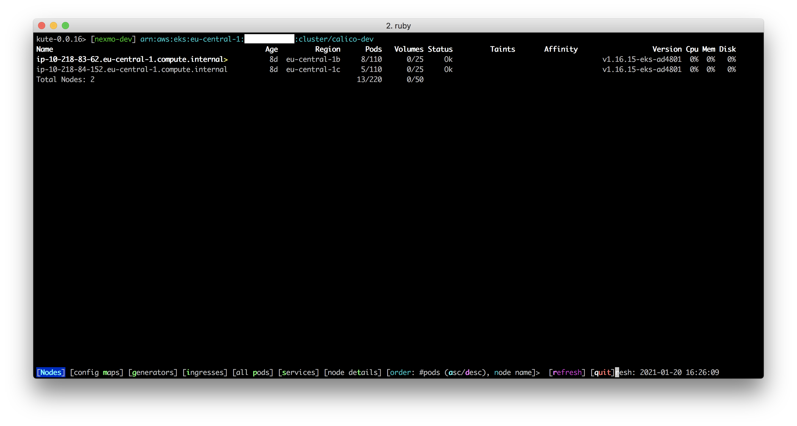
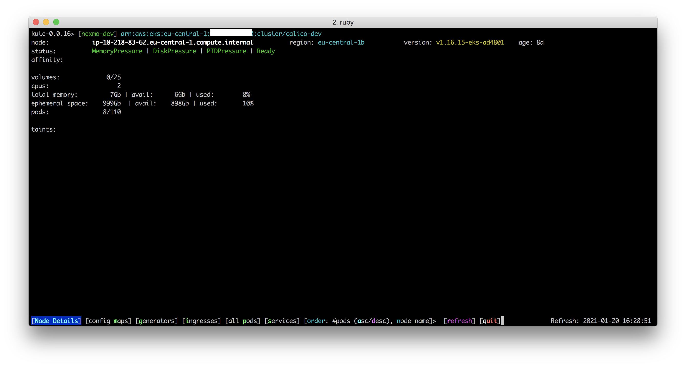
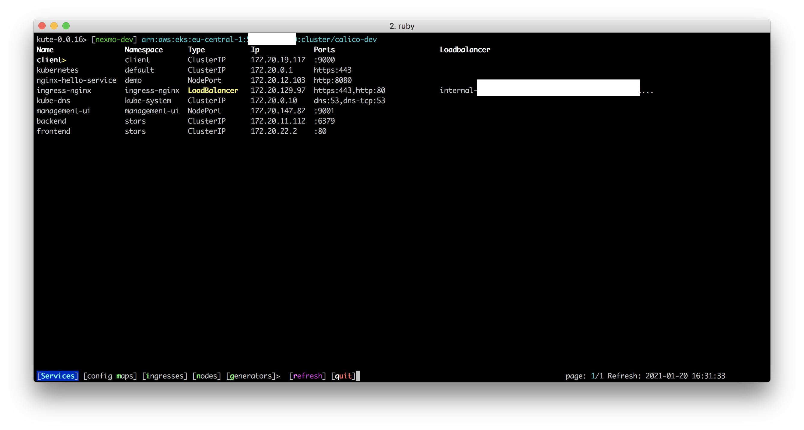
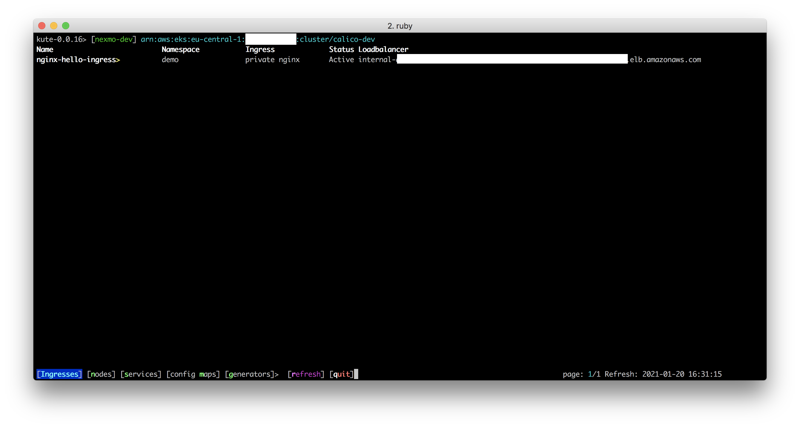
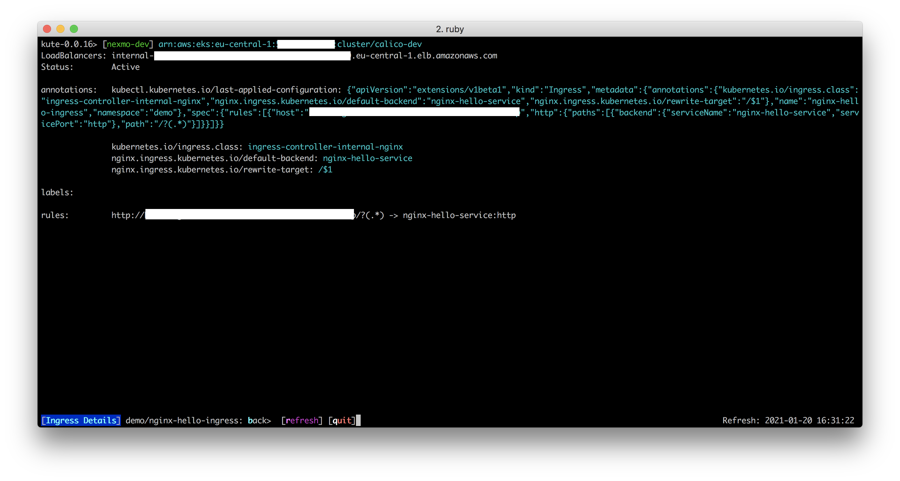
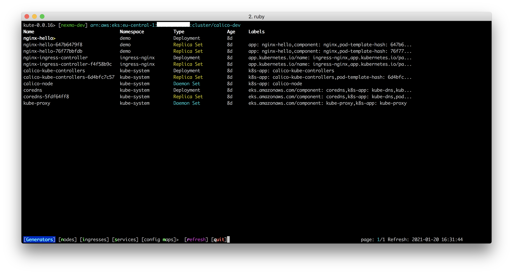
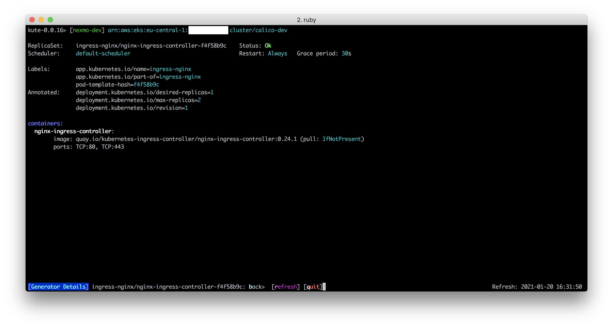
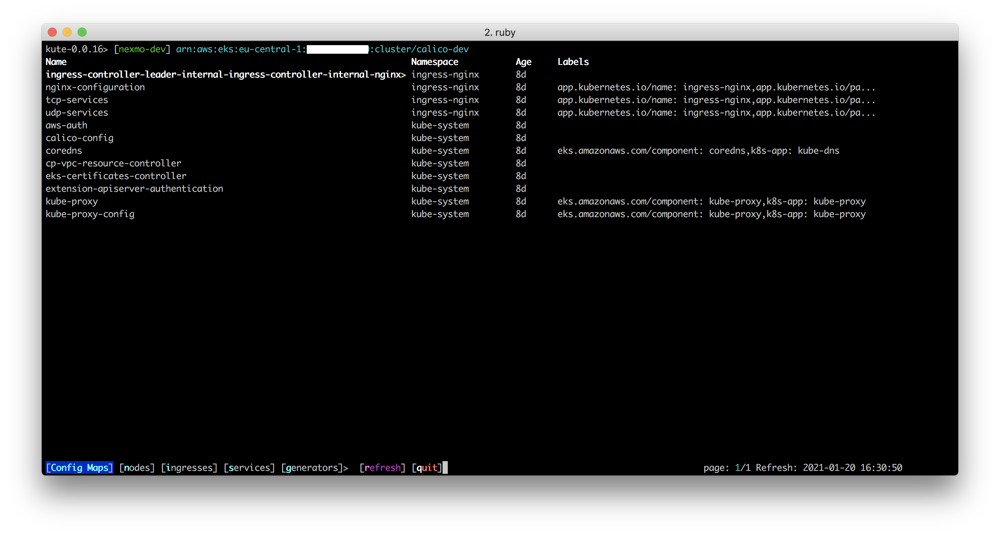
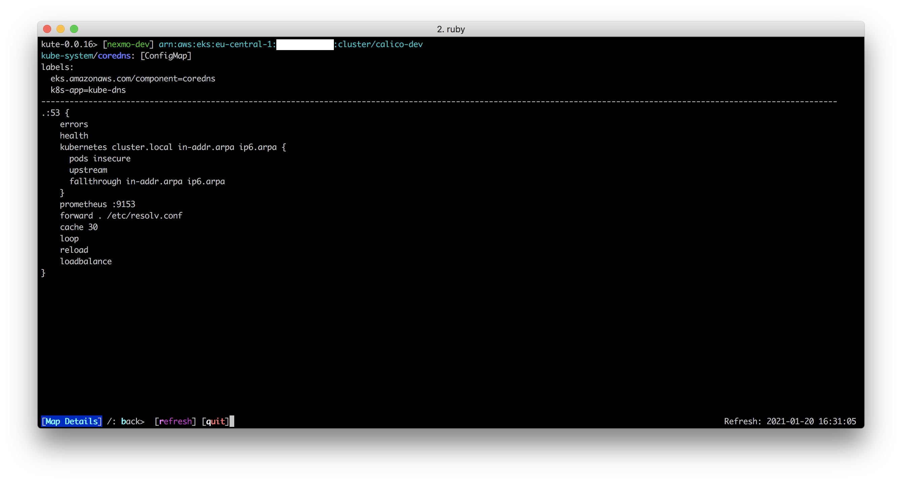

## kute

###### version 0.0.16

###### TODO

See the [oustanding issue list](https://github.com/sacrebleu/kute/issues)
 

#### Overview

`kute` is a lightweight EKS cluster viewer that is intended to provide better information density
than kubectl does.  It creates a heads up display of an EKS cluster, displaying nodes along with
their capacities, kubelet version, and pod and volume capacity based on published AWS stats.

`kute` is intended to provide a very quick top-level view of a cluster that will serve as a launch
point for further investigation when there are issues reported with the cluster.

#### General navigation of resources:

* `^` : Go to the first page
* `space` : Go to the next page
* `b` : Go to the previous page
* `$` : Go to the last page
* `/<some text>` : limit displayed results to those matching the specified pattern

#### Node List

The node listing displays:

* Node name
* Node age in human readable format
* Node region and AZ
* Pods ( running / max possible on this node )
* Volumes ( mounted / max possible on this node )
* Node status
* Taints present on the Node
* Tolerations required on the Node
* EKS client version of the node

The currently selected node is highlighted, and if you wish you can drill down into this node to see details
on the pods and their health, or view metadata about a particular node.  

Nodes with some sort of pod or container related issue are coloured yellow, healthy nodes are terminal default.  

Select the node of interest and hit `enter` or `right` to drill down into pods; `.` displays node metadata.

#### Node metadata

It is possible to view more detailed information about a node from its metadata page - here you can see things like 
cpu count, provisioned disk and memory, and any status flags which may have triggered e.g `MemoryPressure`

Any taints that are set on the node will also be listed here.

#### Pods on a node

In the node details screen, you are presented with a list of pods running on the selected node.  
The pod listing displays:

* Pod Name
* Pod Namespace
* Containers (running / total defined for the pod)
* Volumes
* Pod Status
* Restart count
* An abridged port listing
* The service account
* The IP address of the pod

If there is an issue with any of the containers (i.e. none are state running or state terminated with exit code 0) then
that pod is highlighted in yellow, and the status is set to '*'
 
Hitting `left` will return  you to the node listing.  You can scroll down to select a pod, then hit  `enter` or `right` to drill down into it. 

Selecting a pod gives an overview of that particular pod, showing information such as how it was generated (e.g StatefulSet, ReplicaSet), 
the state of its various containers (`:waiting`, `:running` or `:terminated`) and varied detailed information on all of them
such as image, image pull policy, ports, mounts etc.

The currently selected container is highlighted with an asterisk.  Pressing `l` or `space` will tail the last N lines from the container,
where N is approximately the line height of your terminal - 2 lines.  Pressing `c` will return to the container listing.  Hitting `space` again
will fetch any new logs - kute is not intended to replace `kubectl logs <pod> <container> --tail=N -f`

You can return to the pod listing by hitting `left`

#### Services

It is possible to list all deployed service types by hitting `s` from the main node listing.  Kute will list services, sorted
by namespace and name, and highlight them by category.  LoadBalancers are tagged yellow, while ExternalName is tagged cyan.

Selecting a service will bring up a pane of details about that service:

The details page displays information such as pod ports bound to the service, the type, the annotations, any app selectors
and details of the bound loadbalancer if the service type is `LoadBalancer`

#### Ingresses

Kute can also list the ingresses defined within the cluster, ordered by namespace and name.  Hitting `i` from the main nodes pane
will bring up the ingresses and their statuses:

Ingresses linked to a `public` ingress controller will be highlighted, as will those which are `Inactive`

Selecting an ingress and hitting `right` or `enter` will bring up a pane showing details of that ingress

#### Ingress details

Ingress details shows elements such as labels, annotations, the load balancer bound to the ingress, and the service bound to the ingress.

#### Generators

Kute can list DaemonSets, StatefulSets and Deployments

#### Generator Details

Kute can show information and metadata about DaemonSets, StatefulSets and Deployments, including the containers that they
will spin up.

#### Config Maps

Kute lists config maps

and can show some information from within them.

###### Installation

Ruby 2.5.8 is required by default.  If you do not have ruby, or are using a system ruby,
it is suggested that you install RBEnv as detailed here: [https://github.com/rbenv/rbenv](https://github.com/rbenv/rbenv)

Once rbenv is installed, install ruby 2.5.8 by running `rbenv install` from the root folder of `kute`

    jbotha@mundus:~/ruby/kute$ rbenv install
    
Once ruby 2.5.8 is installed, test it:

    jbotha@mundus:~/ruby/kute$ ruby --version
    ruby 2.5.8p224 (2020-03-31 revision 67882) [x86_64-darwin17]
    
Next, install bundler:    
    
    jbotha@mundus:~/ruby/kute$ gem install bundler
    Fetching: bundler-2.1.1.gem (100%)
    Successfully installed bundler-2.1.1
    Parsing documentation for bundler-2.1.1
    Installing ri documentation for bundler-2.1.1
    Done installing documentation for bundler after 5 seconds
    1 gem installed
    
And then install the gems required by kute:

    jbotha@mundus:~/ruby/kute$ bundle install
    Using public_suffix 4.0.1
       ...
    Bundle complete! 4 Gemfile dependencies, 24 gems now installed.
    Use `bundle info [gemname]` to see where a bundled gem is installed.
    
Finally, verify that kute can be run:

    jbotha@mundus:~$ kute -h
    kute [0.0.16]
    usage: kute.rb [options]
        -v, --[no-]verbose               Log debug information to stdout
            --profile PROFILE            Specify the profile to use for connection
        -m, --maps                       Start with a list of cluster config maps
        -p, --pods                       List all pods running in the cluster
        -g, --generators                 Start with a list of cluster pod generators [deployments, stateful sets, daemonsets and replicasets]
        -s, --services                   Start with a list of cluster services
        -i, --ingresses                  Start with a list of cluster ingresses
    
###### Authentication
      
`kute` searches for `${HOME}/.kube/config` and parses it, looking for information to identify
known EKS clusters.  

It will attempt to locate the `current-context` within this file and use the named cluster
  as its endpoint. 
  
It looks for the environment variable `AWS_PROFILE` and defaults to the `default`
profile if none is specified via `--profile`.   
                  
